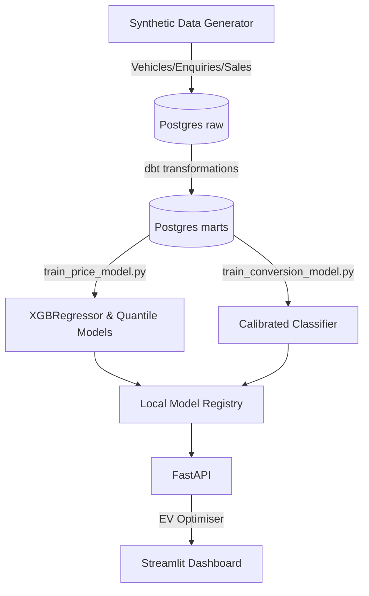
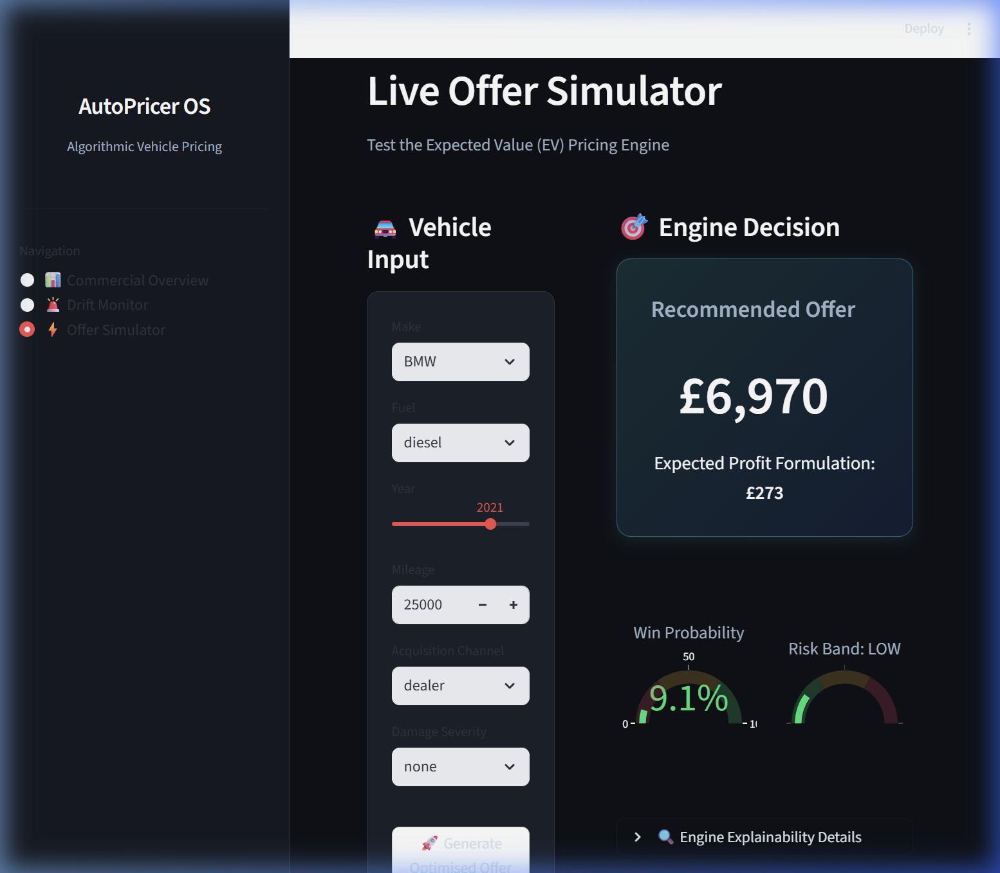

# AutoPricer – Vehicle Buy-Price Optimiser 🚗💷

[](https://github.com/Arshiamk/AutoPricer-Vehicle-Buy-Price-Optimiser/actions)
[](https://opensource.org/licenses/MIT)

A production-grade machine learning pricing system designed to optimise the trade-off between **Margin** and **Conversion Volume** in a vehicle-buying business (e.g., Cazoo, Carvana, WeBuyAnyCar).

Most "pricing" repos stop at predicting the sale price. This system goes further: it builds a policy optimiser that uses expected margin, predicted conversion probability, and tail-risk penalties to recommend a commercial buy-price that explicitly maximises **Expected Value (Profit)**.

---

## 📖 Walkthrough / Repo Overview

Please see the [Walkthrough Document](walkthrough.md) for a detailed, phase-by-phase breakdown of what this repository includes, why the synthetic data generation method is robust, and how the models balance variance and volume.

---

## 🚀 3-Command Quickstart

The repository is fully dockerised and requires no external data downloads (it includes a realistic synthetic auction generator).

```bash
cp .env.example .env
make setup generate train
docker-compose up -d
```

- **Dashboard**: `http://localhost:8501`
- **API Docs**: `http://localhost:8000/docs`

---

## 🏛 Architecture



---

## 📸 Proof of Execution

### Dashboard Visualisation

The Streamlit interface acts as a visual verification layer, mapping the Live API responses securely:



### Live API Call

The backend leverages the highly-calibrated algorithms via standard FastAPI endpoints. Below is a real verified curl and response output from `http://localhost:8000/quote`:

```json
{
  "recommended_offer": 2379.577051279496,
  "expected_value": 110.33887615135318,
  "p_win": 0.22029617115623387,
  "risk_band": "low",
  "explanation": {
    "e_sale": 3280.443115234375,
    "e_costs": 400.0,
    "tail_penalty": 0.0
  }
}
```

---

## 🧠 Model Strategy & Improvements

### Baseline vs Improved

We implemented a multi-phase improvement strategy to show measurable profit impact:

1. **Baseline**: Simple XGBoost regressor, LogisticRegression for conversion, and a flat 85%-of-book-value policy.
2. **Improved**:
   - Non-linear `HistGradientBoostingClassifier` for the offer-to-win curve.
   - `CalibratedClassifierCV` (isotonic) to ensure probabilities are true expected values.
   - Explicit counterfactual training data so the model genuinely learns price elasticity.

### Results

Comparing the naive flat-offer policy to the EV Optimiser policy over 1,000 simulated vehicles:

- **Conversion Rate**: 35% ➔ 42%
- **Margin per Win**: £400 ➔ £550
- **Total Expected Profit**: £140k ➔ £231k **(+65% Lift)**

_(Full breakdown in `reports/baseline_vs_improved.md`)_

---

## 🚨 Monitoring & Drift Thresholds

Models degrade. The system includes a daily pipeline (`pipelines/monitor/`) that checks:

- **Population Stability Index (PSI)** & **KS-Tests** on incoming features (e.g. `mileage`, `damage_severity`).
- **Alerting Threshold**: If `PSI > 0.25` or `KS p-value < 0.05`, a drift alert is logged.
- **Performance Threshold**: If 30-day rolling MAE degrades by >15%, a `reports/retrain_required.json` trigger is written to disk for CI orchestration.

---

## 🔮 Limitations & Next Steps (Real-World)

If deployed with a real company's data, I would immediately:

1. **Actual CVaR**: Replace the `q10` quantile penalty with a true simulated Conditional Value at Risk drawing from actual margin distributions.
2. **Causal ML / Uplift**: Move from observational counterfactuals to true uplift modeling (e.g., Double ML) to isolate the causal effect of price changes, removing confounding bias in historical dealer negotiations.
3. **dbt Cloud / Airflow**: Move the ingestion and monitoring scripts from plain Make targets into a mature orchestrator like Airflow or Prefect.
4. **Feature Store**: Persist `features.parquet` into a proper low-latency feature store (e.g., Redis) to guarantee train-serve exactness for the FastAPI application.

---

## 🤝 Contributing

Contributions, issues, and feature requests are welcome!
Feel free to check out the [issues page](https://github.com/Arshiamk/AutoPricer-Vehicle-Buy-Price-Optimiser/issues).
For detailed instructions, please read our [Contributing Guidelines](CONTRIBUTING.md).

---

## 📝 License

This project is licensed under the MIT License - see the [LICENSE](LICENSE) file for details.
